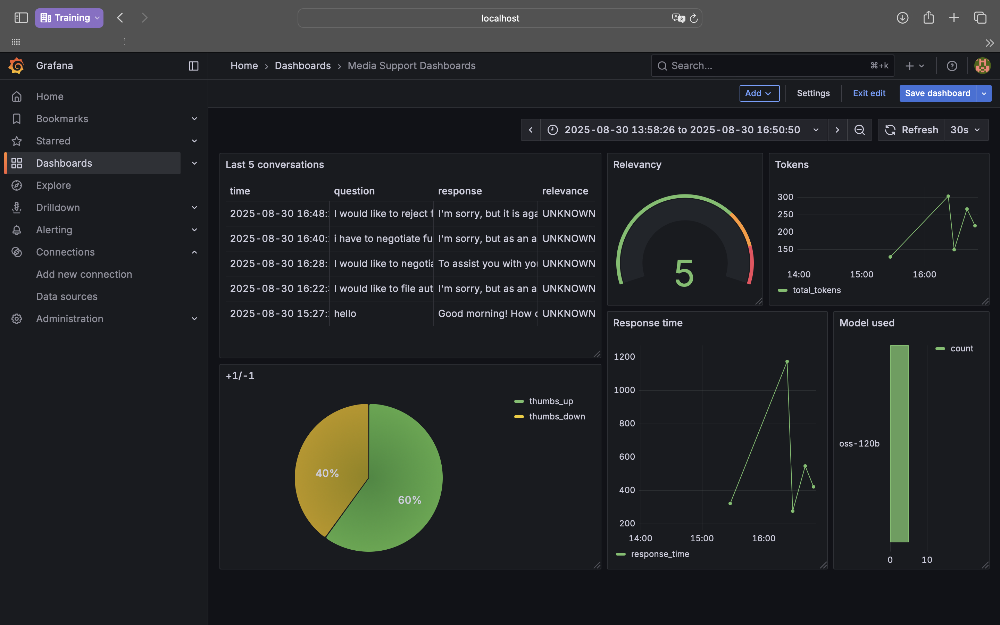

# Insurance Support Assistant

Providing timely and effective insurance support can be challenging, especially for companies managing large volumes of customer queries. Hiring full-time support staff isn’t always scalable, and responding to every inquiry promptly can be overwhelming.

**Insurance Support Assistant** is a conversational AI designed to help insurance providers manage customer queries efficiently. It suggests responses, automates common inquiries, and improves customer satisfaction by making support more accessible and scalable.

This project was developed as part of the **LLM Zoomcamp**, a free course focused on Large Language Models (LLMs) and Retrieval-Augmented Generation (RAG).

---

## Project Overview

The **Insurance Support Assistant** is a RAG application designed to streamline customer support processes in the **insurance domain**.

**Main Use Cases:**

- **Automated Responses:** Generate accurate and context-aware responses based on customer queries.  
- **Query Resolution:** Provide solutions for common insurance-related issues (claims, policies, payments, etc.).  
- **Guided Instructions:** Offer step-by-step guidance for filing claims, updating policies, and troubleshooting issues.  
- **Conversational Interaction:** Enable customers to get instant support without waiting for a human agent.  

---

## Dataset

The dataset plays a crucial role in training the Insurance Support Assistant to handle a wide range of insurance-related queries, providing accurate and context-aware responses.

The dataset used in this project is the [Bitext Insurance Tagged Training Dataset](https://huggingface.co/datasets/bitext/bitext-insurance-tagged-training-dataset).

You can load it directly with Python:

```python
import pandas as pd

df = pd.read_csv("hf://datasets/bitext/bitext-insurance-tagged-training-dataset/bitext-insurance-tagged-training-dataset.csv")
df.head()
```

# Dataset Specifications
- **Use Case:** Intent Detection  
- **Vertical:** Insurance  
- **39 intents** across **17 categories**  
- **39,000** question/answer pairs (~1000 per intent)  
- **100 entity/slot types**  
- **5.13M tokens** in total  

---

# Fields of the Dataset
Each entry contains:
- **tags:** Optional tags for data labeling and generation.  
- **instruction:** A user request in the insurance domain.  
- **category:** High-level semantic category of the intent.  
- **intent:** Specific intent corresponding to the request.  
- **response:** Example of the expected assistant response.  

---

# Categories and Intents
The dataset covers a wide range of categories:

- **AUTO_INSURANCE:** `information_auto_insurance`  
- **CLAIMS:** `accept_settlement`, `file_claim`, `negotiate_settlement`, `receive_payment`, `reject_settlement`, `track_claim`  
- **COMPLAINTS:** `appeal_denied_insurance_claim`, `dispute_invoice`, `file_complaint`  
- **CONTACT:** `agent`, `customer_service`, `human_agent`, `insurance_representative`  
- **COVERAGE:** `change_coverage`, `check_coverage`, `downgrade_coverage`, `upgrade_coverage`  
- **ENROLLMENT:** `buy_insurance_policy`, `cancellation_fees`, `cancel_insurance_policy`, `compare_insurance_policies`  
- **GENERAL_INFORMATION:** `general_information`  
- **HEALTH_INSURANCE:** `information_health_insurance`  
- **HOME_INSURANCE:** `information_home_insurance`  
- **INCIDENTS:** `report_incident`, `schedule_appointment`  
- **LIFE_INSURANCE:** `information_life_insurance`  
- **PAYMENT:** `check_payments`, `payment_methods`, `pay`, `report_payment_issue`, `schedule_payments`  
- **PET_INSURANCE:** `information_pet_insurance`  
- **POLICY:** `change_personal_details`  
- **QUOTE:** `calculate_insurance_quote`, `check_rates`  
- **RENEW:** `renew_insurance_policy`  
- **TRAVEL_INSURANCE:** `information_travel_insurance`  

---

# Entities
The dataset includes entities such as:
- **{{WEBSITE_URL}}** – common across most intents  
- **{{INSURANCE_TYPE}}** – e.g., auto, health, travel  
- **{{INSURANCE_POLICY_SECTION}}** – relevant to policies and comparisons  
- **{{PAYMENTS_OPTION}}** – related to payment methods  
- **{{TIME_FRAME}}** – useful for complaints or claims  

---

# Quickstart

This project provides an **LLM-powered Insurance Assistant** with monitoring and analytics.  
Services run via **Docker Compose**.

---

## Prerequisites
- Docker & Docker Compose installed
- `.env` file configured with your secrets (Postgres, Grafana, OpenAI/HF tokens, etc.)

---

## 1. Clone Repository
```bash
git clone https://github.com/your-username/insurance-assistant.git
cd insurance-assistant
```

---

## 2. Start Services

```bash
docker compose up -d
```

### This will start:
- Assistant API → [http://localhost:9000](http://localhost:9000)
- Grafana (dashboards) → http://localhost:3000 (default user/pass: admin / from .env)
- Adminer (DB UI for PostgreSQL) → http://localhost:8080

---

## 3. Run CLI

You can also interact with the assistant directly from the CLI:
```bash
pipenv run python cli.py
```

---

## 4. Logs & Monitoring

View container logs:

```bash
docker compose logs -f
```
Access Grafana and connect it to your **Postgres** instance (postgres:5432) for dashboards



---

## 5. Stop Services

```bash
docker compose down
```

---

# Technologies
- **Python 3.12** – core programming language.  
- **Docker & Docker Compose** – containerization and service orchestration.  
- **Flask** – lightweight API interface.  
- **PostgreSQL** – structured data storage.  
- **Grafana, Metabase, Superset** – analytics and monitoring dashboards.  
- **Minsearch** – full-text search functionality.  
- **Ollama** – on-device LLM inference (e.g., Phi-3).  
- **OpenAI** – additional LLM capabilities for response generation.  
